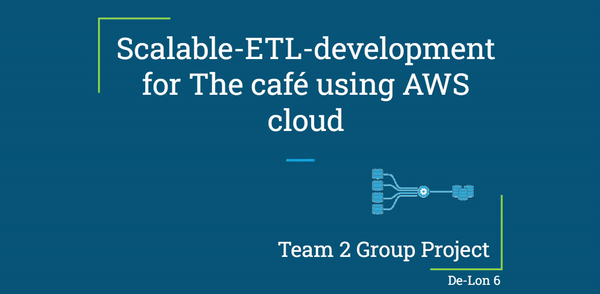

# Overview:
# What is this Project about?
We are crearting an ETL pipeline for a café that has hundreds of outlets across the country.

Due to the demand that the company is receiving, they need to figure out how they can best target new and returning customers, and also understand which products are selling well.

They are experiencing issues with collating and analysing the data they are producing at each branch, as their technical setup is limited.

We have been asked to step in and provide consultation on what they need to do in order to grow their technical offerings, so that they can continue to accelerate their growth.

# Current Situation
A CSV file containing data about every transaction they made for that day is generated at 8pm and the data is uploaded to a piece of software installed in the back office computers.

Also Daily, weekly or monthly reports for sales figures and other related business metrics are created.

# They are facing the following problems:
- The software currently being used only generates reports for single branch.
- It is time consuming to collect data on all branches, and gathering meaningful data for the company on the whole is difficult, due to the limitations of the software.

## As a result
- The company currently has **no way of identifying trends**, meaning they are potentially losing out on major revenue streams.
- They are in desperate need of help putting together a platform that will allow them to easily understand all of the data they are producing.


# Solution
We are tasks to create solutions to solve the problem they're facing.

We have been tasked with building a fully scalable ETL (**E**xtract, **T**ransform, **L**oad) pipeline to handle large volumes of transaction data for the business. This pipeline will collect all the transaction data generated by each individual café and place it in a single location. By being able to easily query the company's data as a whole, the client will drastically increase their ability to identify company-wide trends and insights.

We will be in charge of figuring out how to obtain, process, store and analyse this data.

# Our Goal
- Each night a CSV for each branch will be uploaded to the cloud
- The system we have developed will read each file and perform ETL steps
- Data will be stored in a data warehouse
- Data analytics software will be used to create Business Intelligence analytics for the client
- Application monitoring software will be used to produce operational metrics, such as system errors, up-time and more 


# Implementation / process:

## Planning

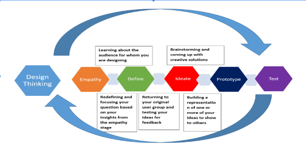

## Technologies Used

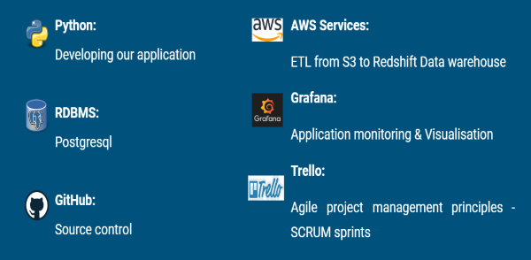

## Star Schema


## ETL Pipeline Architecture

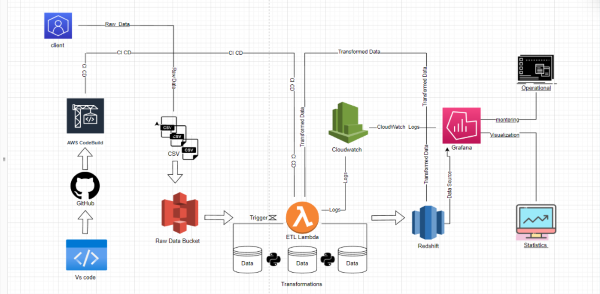


## Extract / Clean


## Transform / Validate

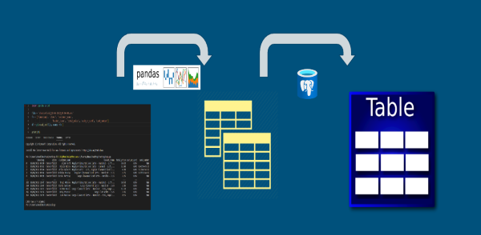


## Load

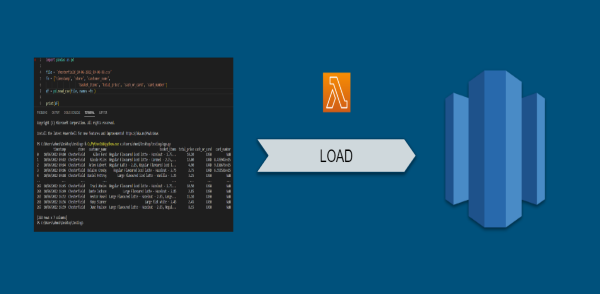


## CI/CD Using CodeBuild

```
Why CI/CD?

To deliver a new version of software - series of steps required
CI/CD automate these steps to improve software delivery throughout the software development life cycle
```
```
Why CodeBUILD?

Fully managed continuous integration service
Readily deployable software packages
Continuous scaling and concurrent processing of  multiple builds
Quick start by using prepackaged build environments
Charged by the minute for the compute
```

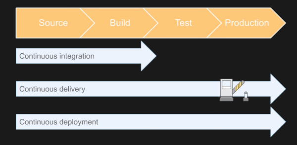


## Successful Implementation

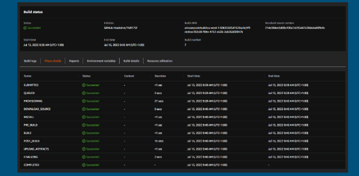

## Analysis & Trends

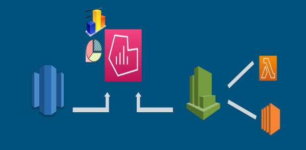

```
Grafana configured with Redshift for database access & Cloudwatch for Lambda, EC2 monitoring
```

## Monitoring Infrastructure

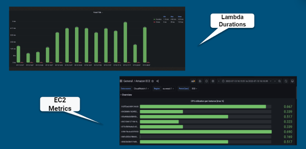


## Insights from multiple variables

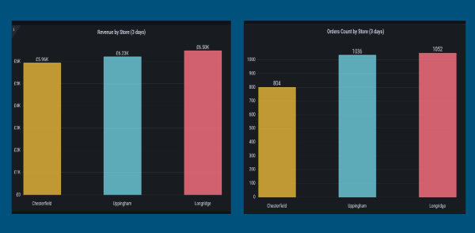

## Sales trend over a period of 5 hrs

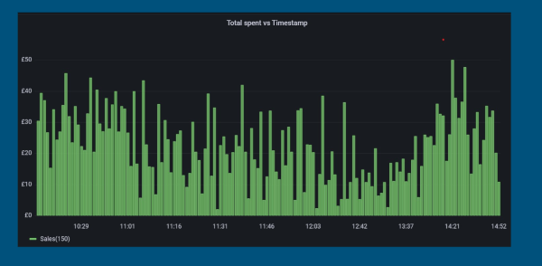


## Highest Selling Product by Volume

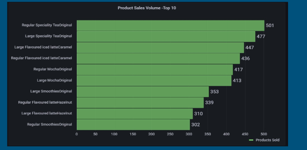


## Maximum Viable Product (MVP)


# Results

## As a Result we were able to answer the following for the clint:
## What?  Where?  When?

```
What - what items were selling well

Where - best performing store

When - peak business hours 
```

# Team values Alignment

## How are you going to balance rest with work?

* By taking regular breaks
* Try to rest on the weekends
* Staying after hours to avoid working on weekends
* Excersise
* Look after your health
* Knowing when to ask for help
 

## How are you going to support yourself and each other?

* Asking questions sooner rather than later
* Nobody gets left behind
* Help each other
* Check on each other
* Accountability – own it.
* Be empathetic and patient to your colleagues

## How are you going to challenge yourself and each other?

* being accountable for sprints or tasks
* Set up clear goals
* taking on challenging tasks

## what professional standards will you uphold?

* Clear professional communication
* Write clean code
* Customer first
* Refactor code
* Testing
* Be specific with features don’t do extra
* Be dependable
* Be efficient (time-management)
* Stay focused on the main goal
* Be patient


## Tasks delegation

* Know what to delegate
* Provide the right resources
* Pair team members with others who are more comfortabe with the task
* Evenly distribute the workload
* Establish a clear communication
* Be patient
* Give credit where it’s due


## Dealing with conflicts?

* communication
* Accept conflict
* Be a calming agent
* Listen actively
* Analyze the conflict
* Model neutral language
* Separate the person from the problem
* Work together
* Agree to disagree
* Maintain confidentiality


## Team operating model

* Using Trello to managed the project in an agile methodology 
* Daily stand ups until the team as a whole is comfortable to move to the next challenge
* Make sure everyone understands the tasks that need to be carried out
* We are all equal no one is superior to someone else
* Quick catch up at the end of the day to assess how every one is doing with their tickets


## Retro

* Discuss what went well and what did not 
* Discuss what could have been better and how we could improve up on it
* Rough guide to what our next steps will be


## Methods of communicating
* Slack
* Zoom
* whatsApp group


## work flow 

* Branch frequently, commit often
* Make small, single-purpose commits
* Write short, detailed commit messages
* Test code and require reviews
* Code reviews before making a merge to main branch
